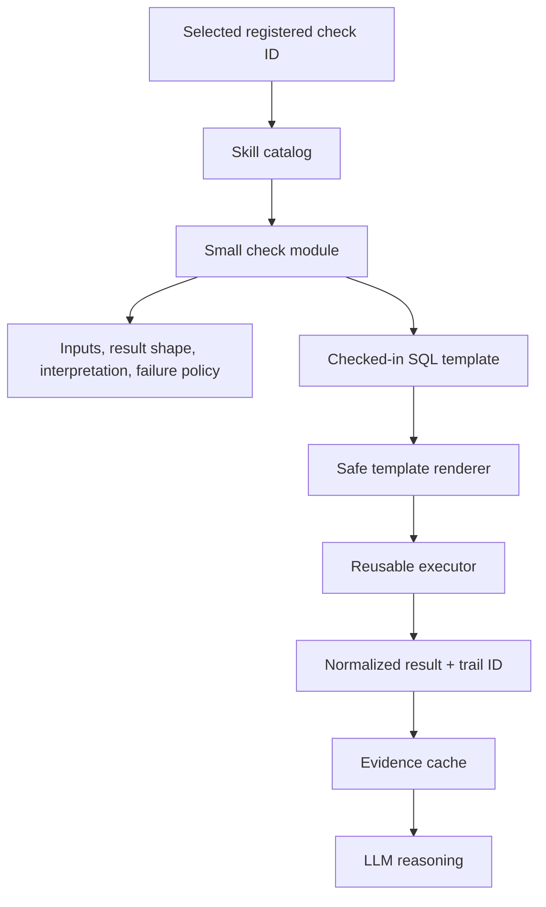

# Smart Table Analyzer architecture

## Purpose

The system investigates Iceberg tables with deterministic collection and
execution, while the LLM provides adaptive orchestration and human-readable
explanations. The LLM never writes SQL or decides low-level execution logic.

## Runtime flow

```mermaid
flowchart LR
    User[User selects Iceberg table] --> UI[Streamlit UI]
    UI --> Runner[DashboardAnalysisRunner]
    Runner --> Pin[Pin Iceberg snapshot]
    Pin --> Legacy[LegacyAnalyzer]

    Legacy --> Metadata[Collected metadata]
    Legacy --> Signals[Deterministic signals]
    Legacy --> Cache[Evidence ledger and baseline cache]

    Metadata --> Profile[Background deep column profile]
    Profile --> Cache
    Signals --> Select
    Cache --> Select[Investigator selection]

    Select -->|choose one eligible skill| Skill[Deterministic skill]
    Skill --> Template[Checked-in SQL template or cached baseline result]
    Template --> Executor[Query executor]
    Executor --> Result[Normalized structured result]
    Result --> Cache

    Cache --> Explain[LLM explanation and recommendation]
    Explain --> Critic[One bounded critic pass]
    Critic --> Report[Validated report]
    Report --> UI

    Profile -->|completed evidence can unlock a relevant check| Select
```

## Responsibility map

| Module | Responsibility | Must not do |
| --- | --- | --- |
| `LegacyAnalyzer` | Collect snapshot-scoped metadata, calculate baseline metrics, and emit deterministic signals. | Recommend changes or perform LLM reasoning. |
| Evidence ledger/cache | Store collected facts, check results, provenance, and proof references. | Recollect already-known metadata. |
| Investigator selection | Choose the next eligible registered skill from measured signals and available evidence. | Generate SQL or select unregistered work. |
| Deterministic skill | Define purpose, inputs, template/fixed logic, result shape, interpretation contract, and failure policy. | Depend on LLM-written SQL. |
| Query executor | Render an allowlisted template safely, execute it, normalize output, retry transient failures, and persist audit records. | Interpret a business finding. |
| LLM Analyst | Read structured evidence and write the explanation, recommendation, and optional follow-up question. | Execute hidden checks, make raw queries, or invent data. |
| Critic | Perform one bounded quality review of the explanation. | Cause a new Analyst loop over unchanged evidence. |
| Report/UI | Present verified evidence, findings, recommendations, progress, and run details. | Treat unverified text as a confirmed measurement. |

## Deterministic skill seam

Adding a check should normally require one small skill, optionally one SQL
template, and independent tests. Skills are registered before the Investigator
can select them.

## Adaptive behavior without free-form SQL

The system is not a fixed checklist:

1. `LegacyAnalyzer` identifies measured conditions, such as small files or
   partition skew.
2. The Investigator selects only a registered skill justified by those
   conditions. A single obvious candidate runs directly; competing candidates
   may be ranked by the LLM.
3. The selected skill returns deterministic evidence.
4. The LLM explains the evidence and can request a relevant follow-up through
   the same registered-skill seam.
5. The background deep profile can add new evidence without blocking the first
   useful response.

## Evidence and retry rules

- Baseline results are reused from the cache rather than re-executed.
- A cached check has no execution retry; a normal executor failure can retry
  once when it may be transient.
- The Analyst has read-only evidence tools. It cannot invoke `run_check`.
- The Critic has one pass. It cannot restart analysis using unchanged facts.
- Proof shows one canonical successful execution per check. Failed attempts
  remain audit data rather than competing user-facing measurements.
- A result without evidence IDs is inconclusive and cannot become a verified
  recommendation.

## User-visible progress

The UI can show useful progress immediately:

`connecting -> snapshot pinned -> metadata collected -> signal found -> deep profile running -> selected skill executed -> report ready`

This separates fast deterministic discovery from background enrichment, while
keeping every final claim traceable to a pinned snapshot and evidence reference.
